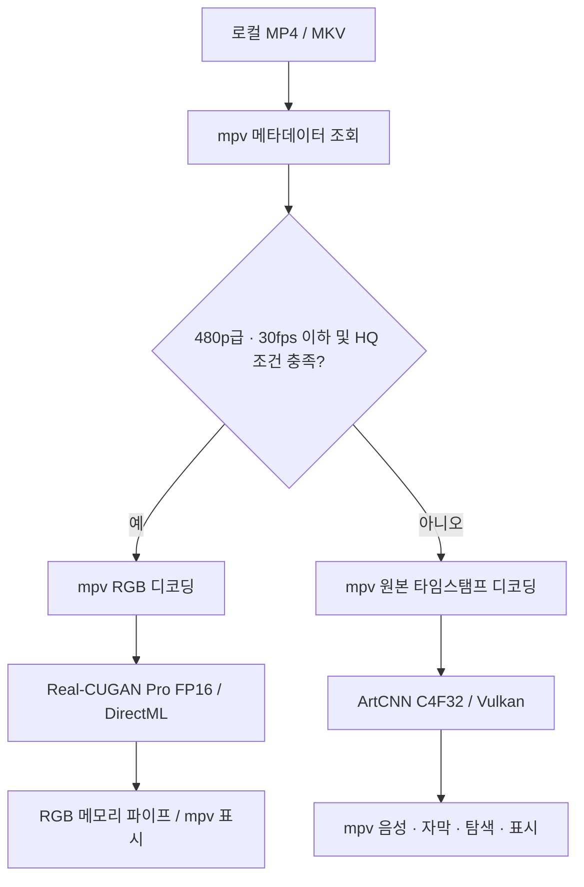

# 구조와 재현



`player.py`는 tkinter 런처, `hq_stream.py`는 선택·재생 래퍼입니다. Real-CUGAN의 CPU RGB 입출력 복사는 유지하지만 전처리·후처리는 GPU 그래프에 통합했습니다. `radeon_device.py`는 DXGI의 장치 이름과 AMD vendor ID로 RX 9070 XT를 찾습니다. DirectML은 CPU fallback을 금지하고 sequential 실행·memory pattern 비활성화·입력 크기 override를 적용합니다.

ArtCNN의 Native 변형은 원본 C4F32 셰이더의 8개 WHEN 조건을 1로 바꿨습니다. 고해상도에서 확대 조건 때문에 CNN이 생략되는 것을 방지합니다. 휘도 CNN이 내부 2배 재구성 후 실제 표시 크기로 리사이즈되므로 최종 창 크기와 내부 재구성 크기는 다릅니다.

## 검증 재현

`setup.cmd` 후 .venv의 Python으로 실행합니다. 영상은 직접 준비해야 합니다. 공개 `docs/benchmarks/corpus.json`은 익명 메타데이터 예시이며 `path`를 본인의 경로로 바꾸세요.

```powershell
.\.venv\Scripts\python.exe compare_speed.py 'D:\Anime\sample480.mp4' --out 'results\speed.json'
.\.venv\Scripts\python.exe validate_model_precision.py 'my-corpus.json' --out 'results\precision'
.\.venv\Scripts\python.exe validate_playback.py 'my-corpus.json' --seconds 10 --out 'results\playback.json'
.\.venv\Scripts\python.exe -m unittest discover -s tests
```

GPU 측정 도구를 동시에 실행하지 마세요. 모델 처리량과 실시간 재생 FPS는 다릅니다. 정밀도 비교는 FP32와 FP16의 수치 차이를 평가하며 HR 정답 대비 복원 품질을 측정하지 않습니다. `compare_speed.py`의 720p 입력은 480p 장면을 합성 확대한 용량 검사입니다.

## 최적화 모델 재생성

```powershell
.\.venv\Scripts\python.exe -m pip install -r requirements-build.txt
.\.venv\Scripts\python.exe build_optimized_model.py vendor/onnx-models/pro-conservative-up2x.onnx vendor/onnx-models/rx9070xt-pro-x2-rgb8-fp16.onnx --fp16
.\.venv\Scripts\python.exe build_optimized_model.py vendor/onnx-models/pro-conservative-up2x.onnx vendor/onnx-models/rx9070xt-pro-x2-rgb8-fp32.onnx
```

入力·출력은 uint8 NHWC입니다. 원본 Pro 정규화는 `RGB × 0.7/255 + 0.15`, 역변환은 `(result − 0.15) × 255/0.7`입니다. 원본 동적 패딩에서 잘못된 구체 크기를 추론하는 문제가 있어 FP16 변환 시 offline shape inference를 끕니다. 가중치를 새 데이터로 재학습하지 않습니다.

외부 자산의 URL·SHA256은 `assets-manifest.json`과 `vendor/sources.json`에 있습니다. 설치 프로그램은 허용한 파일만 ZIP에서 추출하고 해시를 확인합니다. CI는 CPU에서 프로필 경계·Python 구문을 검사하며 실제 RX 9070 XT 재생 테스트를 대신하지 않습니다.
