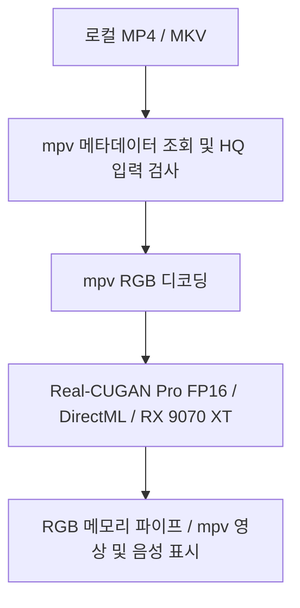

# 구조와 재현



`player.py`는 HQ 전용 tkinter 런처, `hq_stream.py`는 순차 재생 래퍼입니다. 자동 선택이나 대체 재생 경로는 없습니다. CPU RGB 입출력 복사는 유지하고 전처리·후처리는 GPU 그래프에 통합했습니다. `radeon_device.py`는 DXGI의 이름과 AMD vendor ID로 RX 9070 XT를 찾습니다. DirectML은 CPU fallback 금지, sequential 실행, memory pattern 비활성화, 입력 크기 override를 적용합니다.

허용 입력은 짝수 크기·720p 상당 이하·1~60fps·정사각 픽셀·회전 없음입니다. CFR 타이밍을 가정하며 시간 탐색·인터레이스 처리를 지원하지 않습니다. 실제 권장 범위는 480p 이하·30fps 이하입니다.

## 검증 재현

`setup.cmd` 후 .venv의 Python으로 실행합니다. 영상은 직접 준비해야 합니다. 공개 corpus의 `path`를 본인의 경로로 바꾸세요. 지원 범위를 넘는 샘플은 재생 검증에서 `unsupported`로 기록합니다.

```powershell
.\.venv\Scripts\python.exe hq_stream.py 'D:\Anime\sample480.mp4' --frames 240
.\.venv\Scripts\python.exe compare_speed.py 'D:\Anime\sample480.mp4' --out 'results\speed.json'
.\.venv\Scripts\python.exe validate_model_precision.py 'my-corpus.json' --out 'results\precision'
.\.venv\Scripts\python.exe validate_playback.py 'my-corpus.json' --seconds 10 --out 'results\playback.json'
.\.venv\Scripts\python.exe -m unittest discover -s tests
```

GPU 측정 도구는 순차로 실행하세요. 모델 처리량과 실시간 재생 FPS는 다릅니다. FP32 비교 모델은 개발 검증용이며 재생 선택지로 제공하지 않습니다. 정밀도 검사는 HR 정답 대비 복원 화질을 측정하지 않습니다.

## 최적화 모델 재생성

```powershell
.\.venv\Scripts\python.exe -m pip install -r requirements-build.txt
.\.venv\Scripts\python.exe build_optimized_model.py vendor/onnx-models/pro-conservative-up2x.onnx vendor/onnx-models/rx9070xt-pro-x2-rgb8-fp16.onnx --fp16
.\.venv\Scripts\python.exe build_optimized_model.py vendor/onnx-models/pro-conservative-up2x.onnx vendor/onnx-models/rx9070xt-pro-x2-rgb8-fp32.onnx
```

입출력은 uint8 NHWC입니다. 정규화는 `RGB × 0.7/255 + 0.15`, 역변환은 `(result − 0.15) × 255/0.7`입니다. FP16 변환 시 offline shape inference를 끕니다. 외부 자산 URL·SHA256은 `assets-manifest.json`과 `vendor/sources.json`에 있습니다. CI의 입력 범위·파이프·구문 검사는 실제 GPU 재생 검증을 대신하지 않습니다.
